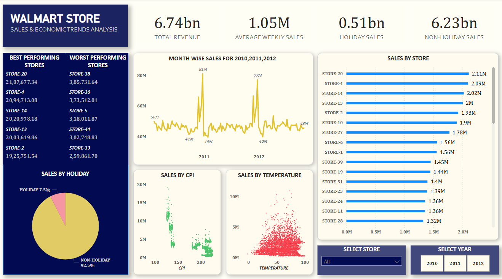

# Walmart-Store-Sales-and-Economic-Trends-Analysis

### **Project Description**
The project focuses on analyzing Walmart’s weekly sales data across multiple stores, combined with economic indicators such as fuel price, CPI (Consumer Price Index), and unemployment rates. The primary goal is to understand sales patterns, assess the impact of holidays, and identify how external economic factors influence sales performance.

### **Objectives:**
- Analyze weekly and monthly sales trends to identify peak and low-performing periods across all stores.
- Compare holiday week sales vs. non-holiday week sales to understand the seasonal impact on revenue.
- Determine the best and worst-performing stores based on total and average weekly sales.
- Assess the correlation between sales and economic factors such as fuel price, CPI, and unemployment rate.
- Build an interactive Power BI dashboard to visualize sales trends, KPIs, and correlations.
- Provide dynamic filters (store, time, holiday flag) for deeper drill-down analysis.
- Generate actionable insights to assist in inventory planning, marketing strategies, and decision-making.

### **Tools Used:**
- Microsoft SQL server 2014
- PowerBI

### **Dataset:**

### **Steps involved in SQL:**
- Data Loading & Cleaning
- Handling missing or blank values.
- SQL-Based Analysis:
    1. Total and average sales overall.
		2. Sales trends by month or year.
		3. Sales comparison: holiday weeks vs. non-holiday weeks.
		4. Store-level performance metrics.
		5. Identify any correlation between sales and CPI/fuel/unemployment.

### **Steps involved in PowerBI:**
- Created additional field 'Month_NAME' for trend analysis.
- Created 'Week_of_month' and 'Week_of_year' fields
- Imported Cleaned Data from SQL.
	- KPIs:
		- Total Revenue
		- Average Weekly Sales
		- Sales on Holidays vs Non-Holidays
		- Best and Worst Performing Stores
	- Visuals:
		- Line chart: Monthly Sales Trend
		- Bar chart: Sales by Store
		- Donut chart: Holiday vs Non-Holiday Sales
		- Scatter plot: Sales vs. CPI
	- Slicers:
		- Store filter
		- Time filter (Year/Month)

### **Dashboard Preview:**

